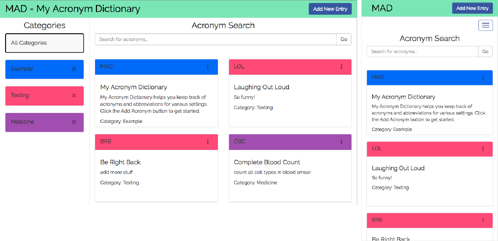

# MAD = My Acronym Dictionary

My Acronym Dictionary allows users to store acronyms and abbreviations by categories. For example, if you need to keep track of specialized abbreviations for medical school but you also want to keep track of the latest acronyms for trendy texting, My Acronym Dictionary will store these for you.

## Summary
Once a user logs in they can:
* View all acronyms
* View acronyms by category
* Search for acronyms by abbreviation or spelled out phrase
* Add new acronyms belonging to existing or new categories
* Edit acronym entries
* Delete single acronyms
* Delete categories and all associated acronyms
* Users can only access and modify acronyms and categories that they created

## Live Site
Visit: [my-acronym-dictionary.herokuapp.com](https://my-acronym-dictionary.herokuapp.com)

## Implementation
The front end of this app was built using static html and css pages and client side javascript and jQuery. The backend was built using Node, Express and MongoDB. Ajax calls were used to pull data from the server using a RESTful API. User sessions and user authentication were implemented using the Express-session and Passport packages.  
